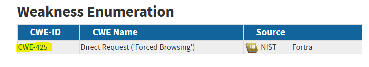
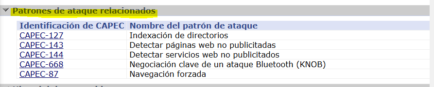
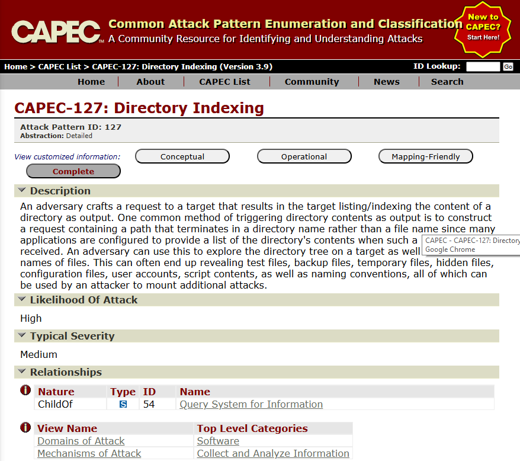
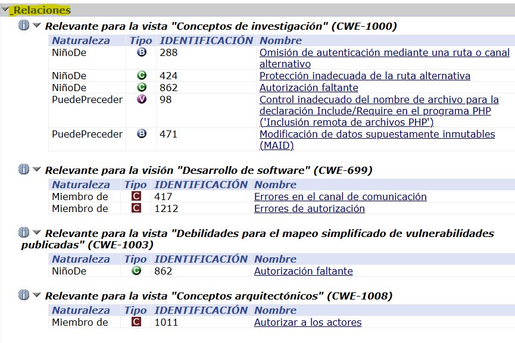
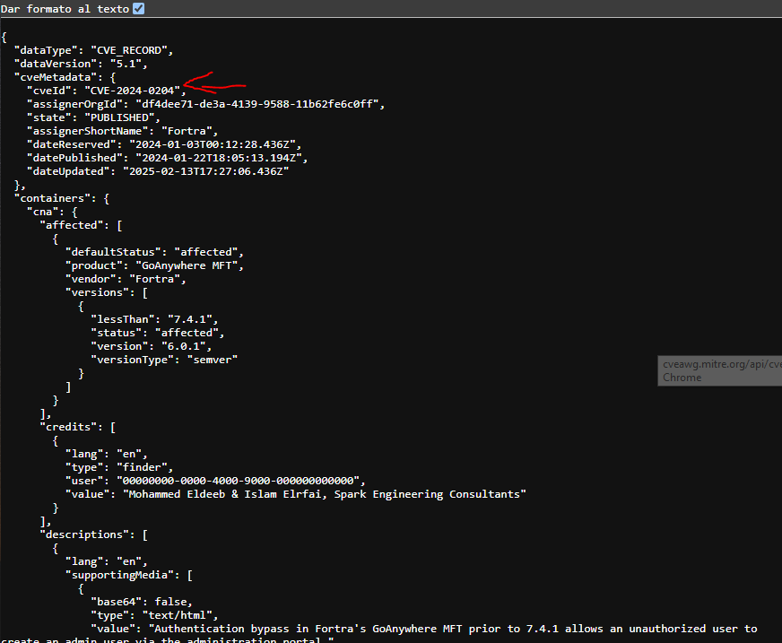

# PPS-Unidad2Actividad1-David

### Ejercicios para entregar

##### Realiza el trazado de la vulnerabilidad de la que informa [este artículo](https://www.incibe.es/empresas/avisos/vulnerabilidad-critica-de-omision-de-autenticacion-en-goanywhere-mft-de-fortra).

# Vulnerabilidad crítica en GoAnywhere MFT (CVE-2024-0204)

La vulnerabilidad crítica identificada como **CVE-2024-0204** afecta a **GoAnywhere MFT** de Fortra, una solución de transferencia gestionada de archivos utilizada por organizaciones para el intercambio seguro de datos.  

Esta vulnerabilidad permite a un atacante remoto no autenticado crear un usuario administrador a través del portal de administración, comprometiendo potencialmente la confidencialidad, integridad y disponibilidad de los datos gestionados por la plataforma. 

## Detalles de la vulnerabilidad:

- **Identificador:** CVE-2024-0204  
- **Severidad:** Crítica (CVSS v3.1: 9.8) 

- **Descripción:** Omisión de autenticación que permite la creación no autorizada de usuarios con privilegios de administrador.  
- **Versiones afectadas:** GoAnywhere MFT desde la versión 6.0.1 hasta la 7.4.0.  
- **Debilidades explotadas:** CWE-425

    - *Descripción*: Las aplicaciones web susceptibles a ataques de solicitud directa a menudo suponen erróneamente que solo se puede acceder a dichos recursos a través de una ruta de navegación determinada y, por lo tanto, solo aplican la autorización en ciertos puntos de la ruta.
    - *Patrones de ataques*: 
    
    Entramos a uno de ellos (CAPEC-127):
    
    Un adversario elabora una solicitud a un objetivo que da como resultado que el objetivo enumere/indexe el contenido de un directorio como salida. Un método común para activar el contenido de un directorio como salida es construir una solicitud que contenga una ruta que termine en un nombre de directorio en lugar de un nombre de archivo, ya que muchas aplicaciones están configuradas para proporcionar una lista del contenido del directorio cuando se recibe dicha solicitud. Un adversario puede usar esto para explorar el árbol de directorios en un objetivo, así como para conocer los nombres de los archivos. Esto a menudo puede terminar revelando archivos de prueba, archivos de respaldo, archivos temporales, archivos ocultos, archivos de configuración, cuentas de usuario, contenido de scripts, así como convenciones de nomenclatura, todo lo cual puede ser utilizado por un atacante para montar ataques adicionales.

    - *Realciones y su naturaleza:*
    

## Soluciones recomendadas:

### 1. Actualización del software  

Fortra ha lanzado la versión **7.4.1** de GoAnywhere MFT que corrige esta vulnerabilidad. Se recomienda encarecidamente actualizar a esta versión o a una posterior.  

### 2. Medidas alternativas  
Si la actualización inmediata no es posible, se pueden aplicar las siguientes mitigaciones temporales:  

- **Implementaciones no basadas en contenedores:**  
  Eliminar el archivo `InitialAccountSetup.xhtml` del directorio de instalación y reiniciar los servicios.  
- **Implementaciones en contenedores:**  
  Reemplazar el archivo `InitialAccountSetup.xhtml` por un archivo vacío y reiniciar los servicios.  

## Recomendaciones adicionales:

- **Monitoreo de cuentas de administrador:**  
  Revisar periódicamente el grupo de "Usuarios Administradores" en el portal de administración de GoAnywhere MFT para detectar cuentas sospechosas o no autorizadas.  
- **Registro y auditoría:**  
  Mantener registros detallados de actividades y accesos para identificar posibles intentos de explotación.  
- **Plan de respuesta a incidentes:**  
  Contar con un plan de gestión de incidentes de seguridad para minimizar el impacto en caso de una brecha.  

## Referencias:

- [Aviso de seguridad de Fortra](https://www.fortra.com/security/advisory/fi-2024-001)  
- [INCIBE: Vulnerabilidad crítica en GoAnywhere MFT](https://www.incibe.es/empresas/avisos/vulnerabilidad-critica-de-omision-de-autenticacion-en-goanywhere-mft-de-fortra)  
- [Vulnearabilidad en NVD](https://nvd.nist.gov/vuln/detail/cve-2024-0204)
- [Debilidad CWE-425](https://cwe.mitre.org/data/definitions/425.html)
- [Detalles de la vulnerabiliad en CVE.org](https://www.cve.org/CVERecord?id=CVE-2024-0204)
    json de la vulnerabiliad.

